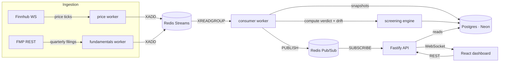

# Aqlis

**Live at [aqlis.fly.dev](https://aqlis.fly.dev)** — real Finnhub prices,
real FMP fundamentals, real compliance verdicts, updating live.

Live Shariah stock-screening dashboard. Aqlis ingests real-time prices and
quarterly fundamentals for a watchlist of companies, runs a rules-based
Shariah compliance screen on each, detects when a stock drifts in or out of
compliance, calculates the purification amount for non-compliant income,
and streams all of it to a live dashboard over WebSockets.

> **Important:** the screening ratios and thresholds implemented here follow
> the [S&P Dow Jones Islamic Market Indices Methodology](https://www.spglobal.com/spdji/en/documents/methodologies/methodology-dj-islamic-market-indices.pdf)
> (S&P Dow Jones Indices LLC, current edition), with one deliberate,
> documented deviation: this tool uses **live (spot) market capitalization**
> rather than the source's 24-month trailing average, so that compliance
> drift is actually visible in real time — the entire point of the project.
> Full rationale in [ADR-002](docs/adr/002-shariah-screening-methodology.md).
> As a result, **Aqlis's verdicts are more volatile than a real index
> provider's** and should not be treated as index-membership-grade.
>
> **Terminology note:** Aqlis calculates *income purification* — donating
> the small, tolerated fraction of a dividend traceable to impermissible
> income (see [ADR-002](docs/adr/002-shariah-screening-methodology.md)).
> This is **not zakat**, the separate obligatory annual wealth tax, which
> Aqlis does not calculate.
>
> This project is an educational implementation of a published methodology,
> **not** a religious ruling. Consult a qualified scholar for personal
> rulings.

## Why I built it

Two reasons, one personal and one technical.

Personal: Shariah compliance screening is usually a paid, black-box service.
I wanted to understand the actual rules: what makes a stock compliant, why a
compliant stock can silently become non-compliant when its price moves, and
how purification is calculated — deeply enough to implement them.

Technical: The problem forces a genuinely interesting pipeline. Prices tick
in sub-second; fundamentals change quarterly. Joining two feeds with wildly
different cadences into one live, correct verdict is a real systems-design
problem — queues, consumers, threshold detection, and push delivery — at a
scale one person can build and defend end to end.

## Architecture



Two feeds with wildly different cadences (sub-second prices, quarterly
fundamentals) join into one live verdict via a durable queue (Streams,
[ADR-004](docs/adr/004-redis-dual-use.md)) and fan out to the browser via
a separate, non-durable one (Pub/Sub, same ADR) — persistence where
losing data matters, none where freshness is all that matters.

## Tech decisions

Every non-trivial choice has an Architecture Decision Record in
[docs/adr](docs/adr/):

- [ADR-001: tech stack](docs/adr/001-tech-stack.md) — the full stack and
  why, including alternatives rejected (Kafka, Socket.IO, AWS, NoSQL)
- [ADR-002: Shariah screening methodology](docs/adr/002-shariah-screening-methodology.md)
  — the cited source, and the one deliberate deviation from it
- [ADR-003: Fly-native deployment](docs/adr/003-fly-native-deployment.md)
  — why Terraform was dropped mid-project, and what replaced it
- [ADR-004: one Redis, two messaging patterns](docs/adr/004-redis-dual-use.md)
  — Streams for ingestion, Pub/Sub for live fan-out, same instance

## How to run

Requires Node 22 (see `.nvmrc`), a Neon Postgres database, and an Upstash
Redis database — plus API keys for [Finnhub](https://finnhub.io) (prices)
and [Financial Modeling Prep](https://financialmodelingprep.com) (fundamentals).

```bash
npm install
cp .env.example apps/server/.env   # then fill in your own credentials

cd apps/server
npx prisma migrate dev             # create the schema
npm run db:seed                    # seed the watchlist companies

# In separate terminals:
npm run dev                        # API server — http://localhost:3000
npm run worker:price                # Finnhub -> Redis Stream
npm run worker:fundamentals         # FMP -> Redis Stream
npm run worker:consumer             # streams -> Postgres, computes verdicts
npm run dev -w @aqlis/web           # dashboard — http://localhost:5173
```

The dashboard dev server proxies `/api` and `/ws` to the API server on
`localhost:3000` (see `apps/web/vite.config.ts`) — no CORS setup needed
locally.

## How to test

```bash
npm test
```

Runs the full unit/integration suite (Vitest) across both workspaces — this
is what CI runs on every push, and it needs no real infrastructure or
secrets: every I/O boundary (Postgres, Redis, external APIs, WebSockets) is
exercised through structural fakes.

There's also one Playwright end-to-end flow (`apps/web/e2e/`) that drives a
real browser against the real stack — real Postgres, real Redis, the actual
built frontend. It's intentionally **not** wired into CI: running it there
would mean putting real Neon/Upstash credentials into GitHub Actions
secrets, which CI has never needed for anything else in this project (every
unit/integration test uses structural fakes at the I/O boundary instead).
Run it locally:

```bash
npx playwright install chromium   # once
npm run test:e2e -w @aqlis/web    # auto-starts both servers, runs the flow, tears them down
```

There's also a k6 load test (`k6/load-test.js`) that ramps 0→20 virtual
users against `/api/companies` and `/api/companies/:symbol/verdict`,
modeling a real dashboard visitor's browsing pattern (list, then one
detail view, then a pause) rather than hammering every endpoint in a
tight loop — a load test aims for realistic usage, not maximum
throughput. Also **not** wired into CI, for the same reason as
Playwright: it needs a real running server against real Postgres/Redis,
which means real credentials CI doesn't have. Run it locally against
the built server:

```bash
npm run build
node apps/server/dist/index.js &   # or point BASE_URL at a different target
npm run loadtest                   # defaults to http://localhost:3000
```

Thresholds: p95 request duration under 500ms, error rate under 1%.
